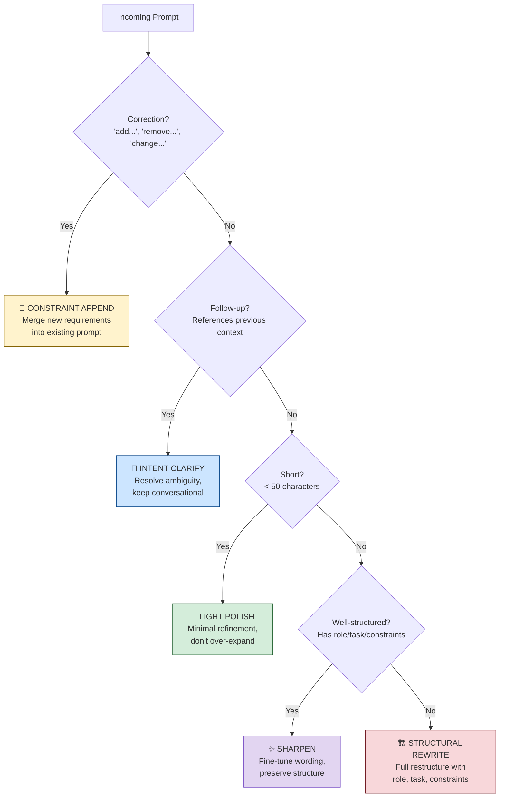

# Prompt Enhancer

[](https://github.com/gentlemouse/prompt-enhancer/actions/workflows/ci.yml)
[](LICENSE)
[](https://github.com/gentlemouse/prompt-enhancer/releases)
[](#testing)

**[简体中文](README.zh-CN.md)** | English

> One-click prompt optimization for every AI platform — smarter input, better output.

A browser extension that **dynamically analyzes** your prompt and applies the **right optimization strategy** before sending it to any AI. Works on ChatGPT, Claude, Gemini, DeepSeek, and 50+ other AI platforms. Zero config, install and go.

---

## Why Prompt Enhancer?

We've all been there — you type a quick question into ChatGPT, get a mediocre answer, then spend 5 minutes rewriting your prompt with better structure, clearer constraints, and specific output requirements. *Then* the AI gives you what you actually wanted.

**The quality of AI output is directly tied to the quality of your input.** But writing great prompts is a skill, and doing it every single time is exhausting.

Prompt Enhancer solves this by acting as an **intelligent layer between you and the AI**. But unlike simple "make it longer" tools, it actually **understands what your prompt needs** and applies a tailored strategy.

### What makes it different?

| Feature | Simple prompt tools | Prompt Enhancer |
|---------|-------------------|-----------------|
| Optimization approach | One-size-fits-all template | Dynamic strategy based on 15+ signal dimensions |
| Short commands | Bloats them unnecessarily | Light polish — keeps them concise |
| Already good prompts | Rewrites them anyway | Detects good structure, only fine-tunes |
| Follow-up questions | Treats as standalone | Understands conversation context (5-turn memory) |
| Corrections ("also add...") | Ignores intent | Merges new constraints into original prompt |

---

## How It Works

When you press `Cmd+Shift+E` (or click the button), Prompt Enhancer runs your input through a 3-stage pipeline:


### Stage 1: Multi-dimensional Analysis

The analyzer examines your prompt across **5 dimensions** simultaneously:

| Dimension | What it detects | Example |
|-----------|----------------|---------|
| **Task Type** | 8 categories: Code, Writing, Analysis, Q&A, Planning, Research, Chat, Extraction | "Write a sorting algorithm" → `CODE` |
| **Complexity** | Chain-of-thought signals, reflection markers, multi-part questions | "Analyze the pros and cons" → `DEEP_THINKING` |
| **Context** | New topic vs. follow-up vs. correction (using session memory) | "Can you elaborate on that?" → `Follow-up` |
| **Structure** | Whether the prompt already has role/task/constraints | "Role: ... Task: ..." → `Well-structured` |
| **Language** | Chinese or English (auto-detected) | Preserves original language |

### Stage 2: Strategy Selection

Based on the analysis, the engine selects **1 of 5 strategies** — each designed for a specific scenario:



### Stage 3: Prompt Building

The selected strategy generates a **specialized system prompt** that instructs the LLM exactly how to optimize your input — then the enhanced version replaces your original text in the input box.

---

## See It in Action

Here's what each strategy does with real examples:

### Strategy 1: Light Polish

> For short, clear commands that just need minor refinements.

| | Content |
|---|---------|
| **Before** | `Translate this paragraph` |
| **After** | `Translate the following paragraph into English. Preserve the original tone and style. For technical terms, keep the original in parentheses.` |
| **What changed** | Added target language, style preservation, and terminology handling — without bloating it. |

### Strategy 2: Structural Rewrite

> For complex requests that need a clear framework.

| | Content |
|---|---------|
| **Before** | `Help me write a Python web scraper for news sites` |
| **After** | `Role: Senior Python developer experienced with web scraping.`<br><br>`Task: Build a news website scraper with the following requirements:`<br>`1. Target: configurable news site URLs`<br>`2. Extract: title, date, author, body text`<br>`3. Handle pagination automatically`<br><br>`Constraints:`<br>`- Use requests + BeautifulSoup`<br>`- Implement rate limiting (1 req/sec)`<br>`- Handle network errors gracefully`<br><br>`Output: Complete, runnable Python script with usage example.` |
| **What changed** | Restructured into role/task/constraints/output framework, making the request unambiguous. |

### Strategy 3: Intent Clarify

> For follow-up questions in a conversation.

| | Content |
|---|---------|
| **Before** | `Can you go into more detail on that?` |
| **After** | `Please elaborate on the "data storage architecture" section from your previous response. Specifically, explain the trade-offs between SQL and NoSQL for this use case, and recommend which to use.` |
| **What changed** | Resolved vague reference ("that"), specified exactly what to elaborate on. |

### Strategy 4: Sharpen

> For prompts that are already well-written but could be tighter.

| | Content |
|---|---------|
| **Before** | `Role: You are a marketing expert.`<br>`Task: Write ad copy for our new product.`<br>`Requirements: Make it engaging and concise.` |
| **After** | `Role: You are a senior marketing copywriter with 10+ years in consumer electronics.`<br>`Task: Write 3 variations of ad copy for our new wireless earbuds.`<br>`Requirements:`<br>`- Tone: energetic, youth-oriented`<br>`- Length: 50-80 words each`<br>`- Include one clear call-to-action per variation`<br>`- Avoid: generic superlatives, competitor comparisons` |
| **What changed** | Sharpened vague terms ("engaging") into specific criteria, added negative constraints. |

### Strategy 5: Constraint Append

> For corrections and additions to a previous prompt.

| | Content |
|---|---------|
| **Before** | `Add error handling and make it async` |
| **After** | `Based on the previous code, please make the following modifications:`<br>`1. Convert all synchronous I/O operations to async/await`<br>`2. Add comprehensive error handling:`<br>`   - Network timeout: retry 3 times with exponential backoff`<br>`   - Invalid data: log warning and skip`<br>`   - Permission error: raise immediately`<br>`3. Keep all existing functionality unchanged.` |
| **What changed** | Integrated corrections into a complete, unambiguous modification request with specifics. |

---

## Features

- **5 Dynamic Strategies** — Automatically selects the right optimization approach for each prompt
- **8 Task Types** — Recognizes code, writing, analysis, Q&A, planning, research, chat, and extraction tasks
- **3 Reasoning Modes** — Adjusts between Simple, Deep Thinking, and Expert modes based on complexity
- **Session Memory** — 5-turn sliding window tracks conversation context for smarter follow-up handling
- **Zero Config** — Install and use immediately with 10 free enhancements per day, no API key needed
- **BYOK Mode** — Bring your own API key (OpenAI / Anthropic / DeepSeek / custom) for unlimited use
- **50+ Platforms** — Works on ChatGPT, Claude, Gemini, DeepSeek, Kimi, Qwen, and many more
- **Privacy First** — API keys encrypted locally, zero prompt content collection, opt-out analytics
- **Keyboard Shortcut** — `Cmd/Ctrl+Shift+E` to enhance, `Ctrl+Z` to undo

## Install

### Chrome Web Store

<!-- TODO: Replace with actual link after review -->
> Coming soon.

### Edge Add-ons

<!-- TODO: Replace with actual link after review -->
> Coming soon.

### Build from Source

```bash
git clone https://github.com/gentlemouse/prompt-enhancer.git
cd prompt-enhancer
npm install
npm run build
```

1. Open `chrome://extensions/` (Chrome) or `edge://extensions/` (Edge)
2. Enable "Developer mode"
3. Click "Load unpacked"
4. Select the `dist` directory

## Usage

### Free Mode (No setup required)

Install and start using on any AI chat page — 10 free enhancements per day.

### BYOK Mode (Unlimited)

1. Click the extension icon to open settings
2. Select API provider (OpenAI / Anthropic / DeepSeek / Custom)
3. Enter your API key and save
4. Unlimited enhancements unlocked

### Shortcuts

| Action | Mac | Windows / Linux |
|--------|-----|-----------------|
| Enhance | `⌘⇧E` | `Ctrl+Shift+E` |
| Undo | `⌘Z` | `Ctrl+Z` |

## Architecture

```
src/
├── background/              # Service Worker
│   ├── analyzer.ts          # Multi-dimensional analysis + strategy engine
│   ├── prompt-builder.ts    # 5 strategy templates
│   ├── enhancer.ts          # Orchestrator
│   └── providers/           # API adapters (OpenAI/Anthropic/DeepSeek/Proxy)
├── content/                 # Content Script
│   ├── services/
│   │   ├── input-detector.ts   # Input field detection
│   │   └── session-memory.ts   # Session memory (sliding window)
│   └── ui/                  # Shadow DOM isolated UI
├── shared/                  # Shared modules
│   ├── analytics.ts         # Anonymous usage analytics
│   ├── fingerprint.ts       # Device fingerprint (anti-abuse)
│   ├── trial.ts             # Free trial management
│   └── utils/               # Encryption, retry, validation
├── popup/                   # Settings page + onboarding
└── manifest.ts              # Chrome Extension Manifest V3
```

## Development

```bash
npm run dev            # Dev mode (HMR)
npm run build          # Production build
npm run test           # Run tests
npm run test:coverage  # Tests + coverage report
npm run lint           # ESLint
npm run type-check     # TypeScript type check
```

### Testing

Core module coverage: **97.99%** (146 test cases)

| Module | Statements | Branches | Functions | Lines |
|--------|-----------|----------|-----------|-------|
| analyzer.ts | 98.83% | 98.11% | 100% | 98.64% |
| prompt-builder.ts | 100% | 80% | 100% | 100% |
| session-memory.ts | 100% | 100% | 100% | 100% |
| analytics.ts | 95% | 86.11% | 100% | 94.52% |
| validation.ts | 100% | 100% | 100% | 100% |
| retry.ts | 96.96% | 91.3% | 100% | 96.55% |

## Tech Stack

- **TypeScript** — Strict mode, full type safety
- **Vite + CRXJS** — Modern build tooling with HMR
- **Vitest** — Unit tests + coverage
- **ESLint + Prettier + Husky** — Code quality + commit gates
- **GitHub Actions** — CI/CD automation
- **Cloudflare Workers** — API proxy layer (free tier service)
- **Chrome Extension Manifest V3**

## Privacy

- **Zero prompt collection** — Your prompts are never stored or transmitted beyond the AI provider
- **Encrypted API keys** — Stored locally in `chrome.storage.local`, never synced to cloud
- **HTTPS enforced** — Custom API endpoints require HTTPS
- **Opt-out analytics** — Anonymous usage stats can be disabled anytime
- See full [Privacy Policy](docs/privacy-policy.md)

## Contributing

Contributions welcome! Please:

1. Fork this repository
2. Create a feature branch (`git checkout -b feature/amazing-feature`)
3. Commit your changes (`git commit -m 'feat: add amazing feature'`)
4. Push to the branch (`git push origin feature/amazing-feature`)
5. Open a Pull Request

## License

[MIT](LICENSE) © mouse 张
