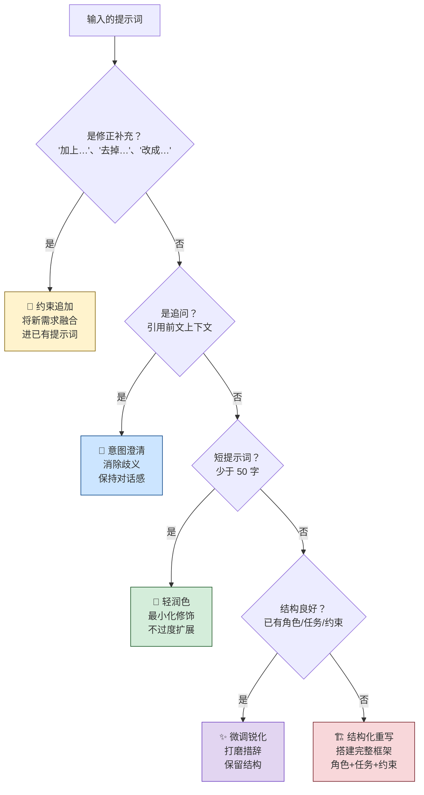

# 灵犀

[](https://github.com/gentlemouse/prompt-enhancer/actions/workflows/ci.yml)
[](LICENSE)
[](https://github.com/gentlemouse/prompt-enhancer/releases)
[](#测试)

简体中文 | **[English](README.md)**

> 心有灵犀一点通

一个浏览器扩展，**动态分析**你的提示词并自动选择**最合适的优化策略**。支持 ChatGPT、Claude、Gemini、DeepSeek 等 50+ AI 平台，安装即用，零配置。

---

## 为什么需要灵犀？

你一定遇到过这种情况 —— 随手给 ChatGPT 打了一行字，得到一个平庸的回答；然后花 5 分钟重写提示词，加上结构、约束、输出格式要求……AI 终于给出了你真正想要的结果。

**AI 输出的质量，直接取决于你输入的质量。** 但每次都精心编写提示词，太累了。

灵犀就是你和 AI 之间的**智能优化层**。但它不是简单地「把提示词变长」，而是**真正理解你的提示词需要什么**，然后选择最合适的策略。

### 和其他工具有什么不同？

| 特性 | 普通提示词工具 | 灵犀 |
|------|-------------|-----------------|
| 优化方式 | 一刀切的模板 | 基于 15+ 维度信号的动态策略 |
| 短指令 | 不必要地膨胀 | 轻润色 —— 保持简洁 |
| 已经写好的提示词 | 照样重写 | 识别良好结构，只做微调 |
| 追问 | 当作独立问题处理 | 理解对话上下文（5 轮记忆） |
| 补充修正（「再加上……」） | 忽略意图 | 将新约束融合进原始提示词 |

---

## 工作原理

按下 `Cmd+Shift+E`（或点击按钮），灵犀将你的输入送入 3 阶段处理流水线：


### 第一阶段：多维特征分析

分析器同时从 **5 个维度** 检测你的提示词：

| 维度 | 检测内容 | 示例 |
|------|---------|------|
| **任务类型** | 8 大类：代码、写作、分析、问答、规划、研究、闲聊、信息提取 | "写一个排序算法" → `CODE` |
| **复杂度** | 思维链信号、反思标记、多重问题 | "分析利弊" → `DEEP_THINKING` |
| **上下文** | 新话题 / 追问 / 修正补充（基于会话记忆） | "那个能再详细点吗" → `追问` |
| **结构** | 是否已包含角色/任务/约束等结构 | "角色：… 任务：…" → `结构良好` |
| **语言** | 中文 / 英文（自动识别） | 保持原始语言输出 |

### 第二阶段：策略选择引擎

基于分析结果，引擎从 **5 套策略** 中选择最合适的一个 —— 每套策略专为特定场景设计：



### 第三阶段：提示词构建

选中的策略会生成一个**专用系统提示词**，精确指导 LLM 如何优化你的输入 —— 然后增强后的版本直接替换输入框中的原文。

---

## 实际效果演示

来看看每种策略的真实效果：

### 策略 1：轻润色

> 适用于简短、意图明确的指令，只补充缺失的关键信息。

| | 内容 |
|---|------|
| **优化前** | `翻译这段话` |
| **优化后** | `将以下段落翻译为英文，保持原文语气和风格。如遇专业术语，请在译文后用括号标注原文。` |
| **变化** | 补充了目标语言、风格要求、术语处理规则 —— 但没有过度膨胀。 |

### 策略 2：结构化重写

> 适用于复杂的首轮请求，需要搭建完整的提示词框架。

| | 内容 |
|---|------|
| **优化前** | `帮我写个 Python 爬虫爬新闻网站` |
| **优化后** | `角色：资深 Python 开发者，擅长 Web 爬虫和数据采集。`<br><br>`任务：开发一个新闻网站爬虫，要求如下：`<br>`1. 支持可配置的目标网站 URL`<br>`2. 提取字段：标题、发布日期、作者、正文`<br>`3. 自动处理分页`<br><br>`约束：`<br>`- 使用 requests + BeautifulSoup`<br>`- 请求间隔不少于 1 秒（防封）`<br>`- 网络异常时优雅降级，不中断整体流程`<br><br>`输出：完整可运行的 Python 脚本，附使用示例。` |
| **变化** | 重构为「角色 / 任务 / 约束 / 输出」框架，消除歧义。 |

### 策略 3：意图澄清

> 适用于多轮对话中的追问，让追问更具体。

| | 内容 |
|---|------|
| **优化前** | `那个能再详细点吗` |
| **优化后** | `请对上述方案中「数据存储架构」部分进行更详细的展开说明，重点对比 SQL 和 NoSQL 在此场景下的优劣，并给出推荐方案。` |
| **变化** | 解析了模糊的「那个」，明确了追问方向和期望的回答深度。 |

### 策略 4：微调锐化

> 适用于已经写得不错的结构化提示词，只做措辞打磨。

| | 内容 |
|---|------|
| **优化前** | `角色：你是一个营销专家。`<br>`任务：为我们的新产品写广告文案。`<br>`要求：吸引人，简洁。` |
| **优化后** | `角色：你是一位资深营销文案专家，拥有 10 年消费电子行业经验。`<br>`任务：为我们新推出的无线耳机撰写 3 版广告文案。`<br>`要求：`<br>`- 风格：活力、年轻化`<br>`- 篇幅：每版 50-80 字`<br>`- 每版包含一个明确的行动号召（CTA）`<br>`- 避免：空洞的最高级形容词、竞品对比` |
| **变化** | 将「吸引人」等模糊描述锐化为可执行的具体标准，添加负面约束。 |

### 策略 5：约束追加

> 适用于对上一轮提示词的补充或修正。

| | 内容 |
|---|------|
| **优化前** | `加上错误处理，改成异步的` |
| **优化后** | `在之前代码的基础上，请进行以下修改：`<br>`1. 将所有同步 I/O 操作改为 async/await 异步模式`<br>`2. 添加完善的错误处理机制：`<br>`   - 网络超时：指数退避重试 3 次`<br>`   - 数据异常：记录警告日志并跳过`<br>`   - 权限错误：立即抛出异常`<br>`3. 保持原有功能不变。` |
| **变化** | 将零散的修改要求整合为完整、无歧义的修改方案。 |

---

## 功能特性

- **5 套动态策略** — 根据提示词特征自动选择最合适的优化方式
- **8 种任务类型** — 识别代码、写作、分析、问答、规划、研究、闲聊、信息提取
- **3 级推理模式** — 根据复杂度在简单、深度思考、专家模式之间动态切换
- **会话记忆** — 5 轮滑动窗口追踪对话上下文，智能区分新话题 / 追问 / 修正
- **开箱即用** — 安装后直接使用，终身 10 次免费增强，无需配置 API Key
- **自带 Key 模式** — 接入 OpenAI / Anthropic / DeepSeek / Kimi / MiniMax / 通义千问 / 智谱 / 自定义 API，无限使用
- **50+ 平台** — 支持 ChatGPT、Claude、Gemini、DeepSeek、Kimi、通义千问等
- **隐私优先** — API Key 加密本地存储，不采集任何 prompt 内容，可选匿名统计支持 opt-out
- **快捷键** — `Cmd/Ctrl+Shift+E` 润色，`Ctrl+Z` 撤回

## 安装

### Chrome Web Store

<!-- TODO: 审核通过后替换为实际链接 -->
> 即将上线，敬请期待。

### Edge Add-ons

<!-- TODO: 审核通过后替换为实际链接 -->
> 即将上线，敬请期待。

### 从源码构建

```bash
git clone https://github.com/gentlemouse/prompt-enhancer.git
cd prompt-enhancer
npm install
npm run build
```

1. 打开 `chrome://extensions/`（Chrome）或 `edge://extensions/`（Edge）
2. 启用「开发者模式」
3. 点击「加载已解压的扩展程序」
4. 选择项目的 `dist` 目录

## 使用方式

### 免费模式（无需配置）

安装后直接在任何 AI 聊天页面使用，终身 10 次免费增强。

### 自带 Key 模式（无限使用）

1. 点击扩展图标打开设置
2. 选择 API 提供商（OpenAI / Anthropic / DeepSeek / 自定义）
3. 输入 API Key → 保存
4. 解锁无限次增强

### 快捷键

| 操作 | Mac | Windows / Linux |
|------|-----|-----------------|
| 润色 | `⌘⇧E` | `Ctrl+Shift+E` |
| 撤回 | `⌘Z` | `Ctrl+Z` |

## 架构

```
src/
├── background/              # Service Worker
│   ├── analyzer.ts          # 多维特征分析 + 策略选择引擎
│   ├── prompt-builder.ts    # 5 套策略模板
│   ├── enhancer.ts          # 协调器
│   └── providers/           # API 适配器（OpenAI/Anthropic/DeepSeek/Proxy）
├── content/                 # Content Script
│   ├── services/
│   │   ├── input-detector.ts   # 输入框智能检测
│   │   └── session-memory.ts   # 会话记忆（滑动窗口）
│   └── ui/                  # Shadow DOM 隔离的 UI 组件
├── shared/                  # 共享模块
│   ├── analytics.ts         # 匿名行为统计
│   ├── fingerprint.ts       # 设备指纹（防滥用）
│   ├── trial.ts             # 免费试用管理
│   └── utils/               # 加密、重试、验证
├── popup/                   # 设置页面 + 新手引导
└── manifest.ts              # Chrome Extension Manifest V3
```

## 开发

```bash
npm run dev            # 开发模式（热重载）
npm run build          # 生产构建
npm run test           # 运行测试
npm run test:coverage  # 测试 + 覆盖率报告
npm run lint           # ESLint 检查
npm run type-check     # TypeScript 类型检查
```

### 测试

核心模块测试覆盖率 **97.99%**（146 个测试用例）：

| 模块 | 语句 | 分支 | 函数 | 行 |
|------|------|------|------|-----|
| analyzer.ts | 98.83% | 98.11% | 100% | 98.64% |
| prompt-builder.ts | 100% | 80% | 100% | 100% |
| session-memory.ts | 100% | 100% | 100% | 100% |
| analytics.ts | 95% | 86.11% | 100% | 94.52% |
| validation.ts | 100% | 100% | 100% | 100% |
| retry.ts | 96.96% | 91.3% | 100% | 96.55% |

## 技术栈

- **TypeScript** — 严格模式，全面类型安全
- **Vite + CRXJS** — 现代化构建，HMR 热重载
- **Vitest** — 单元测试 + 覆盖率
- **ESLint + Prettier + Husky** — 代码规范 + 提交门禁
- **GitHub Actions** — CI/CD 自动化
- **Cloudflare Workers** — API 代理层（免费额度服务）
- **Chrome Extension Manifest V3**

## 隐私

- **不采集任何 prompt 内容** — 你的提示词不会被存储或传输到 AI 提供商之外的任何地方
- **API Key 加密存储** — 保存在本地 `chrome.storage.local`，不同步到云端
- **强制 HTTPS** — 自定义 API 地址必须使用 HTTPS
- **可关闭的匿名统计** — 匿名使用数据可随时 opt-out
- 详见 [隐私政策](docs/privacy-policy.md)

## 参与贡献

欢迎贡献！请先：

1. Fork 本仓库
2. 创建特性分支 (`git checkout -b feature/amazing-feature`)
3. 提交更改 (`git commit -m 'feat: add amazing feature'`)
4. 推送到分支 (`git push origin feature/amazing-feature`)
5. 提交 Pull Request

## 许可证

[MIT](LICENSE) © mouse 张
